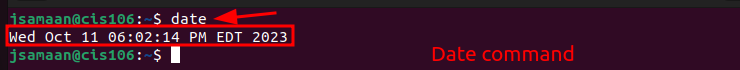
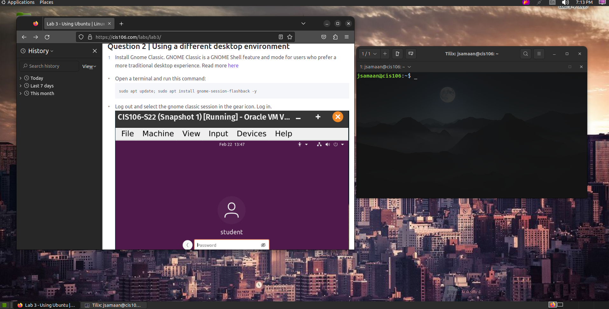

# Lab 3 Submission

## Question 1

## Question 2

## Question 3

| Program purpose     | Package Name     | Version                            |
| ------------------- | ---------------- | ---------------------------------- |
| Play a tetris game  | ltris            | 1.0.19-3build1                     |
| Play a video file   | dragonplayer     | 4:21.12.3-0ubuntu1                 |
| Browse the internet | epiphany-browser | 42.4-0ubuntu1                      |
| Read your email     | geary            | 40.0-2                             |
| Play music          | clementine       | 1.4.0~rc1+git347-gfc4cb6fc7+dfsg-2 |

## Question 4

| command | what it does                                                                                           |
| ------- | ------------------------------------------------------------------------------------------------------ |
| echo    | displays a line of text that is colored                                                                |
| fortune | prints out random epigram sorting it                                                                   |
| cowsay  | generates picture of cow saying what you input                                                         |
| lolcat  | standard input to standard output in rainbow coloring                                                  |
| figlet  | output turns into bubbly text used mostly at the bottom of pages                                       |
| toilet  | prints text using large characters made of smaller ones with different colors and export formats       |
| rig     | piece together random first and last name street and address with a geographically conistent area code |