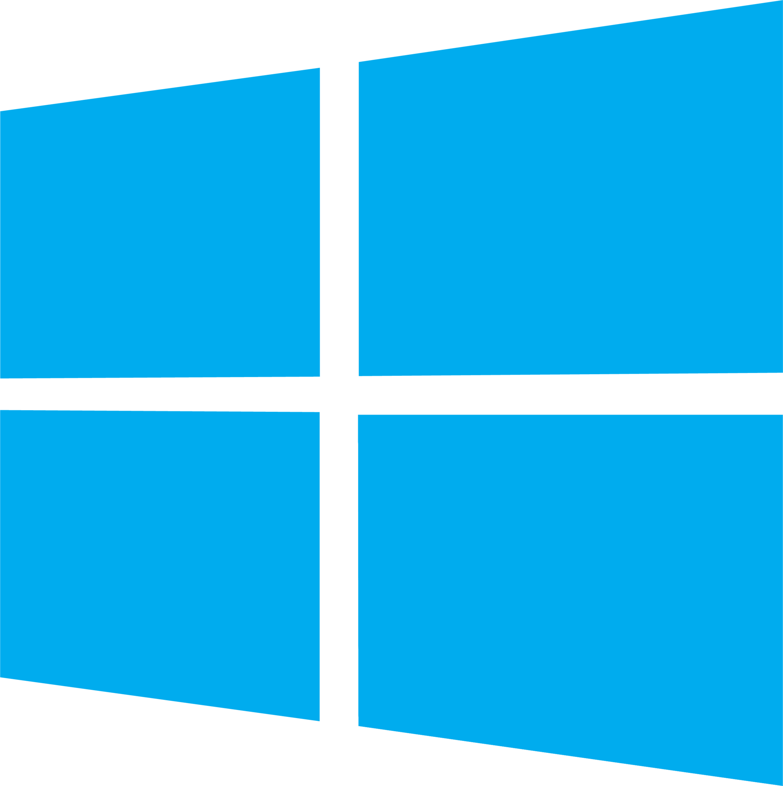
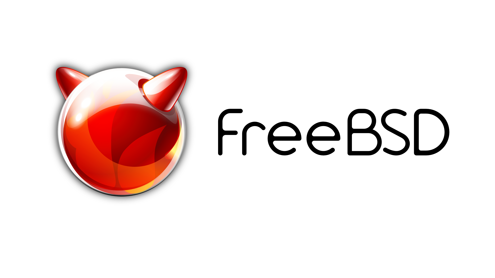

# What is GNU+Linux?
GNU+Linux is an open source operating system
# 3 Reasons to use GNU+Linux:
* Reason 1: Being able to customize your system to its full potential.
* Reason 2: It being open source allows everyone to have access to lots of things.
* Reason 3: Can directly manage system resources and hardware like memory, storage and CPU.

# Other operating systems
* **Microsoft Windows** is a group of several proprietary graphical operating system families, all of which are developed and marketed by Microsoft.
 
* **macOS** is a series of proprietary graphical operating systems developed and marketed by Apple Inc.
 
* **FreeBSD** is a free and open-source Unix-like operating system descended from the Berkeley Software Distribution (BSD), which was based on Research Unix.

* **RISC OS** is a computer operating system originally designed by Acorn Computers Ltd in Cambridge, England. 

