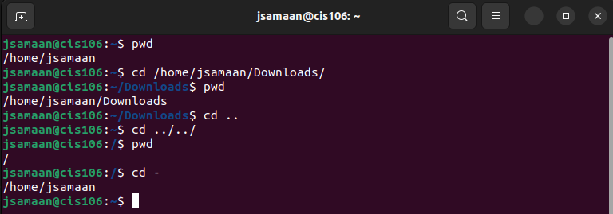
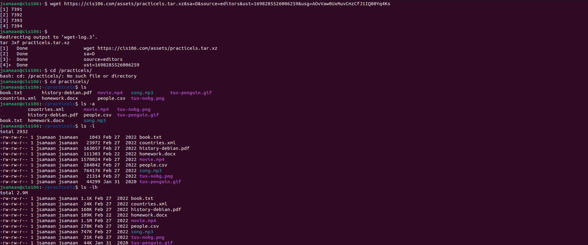
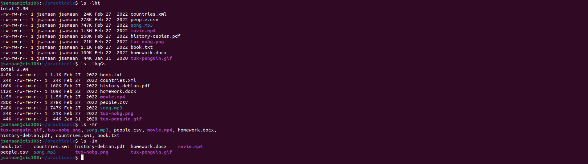
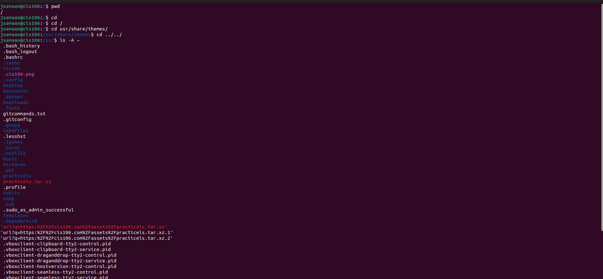
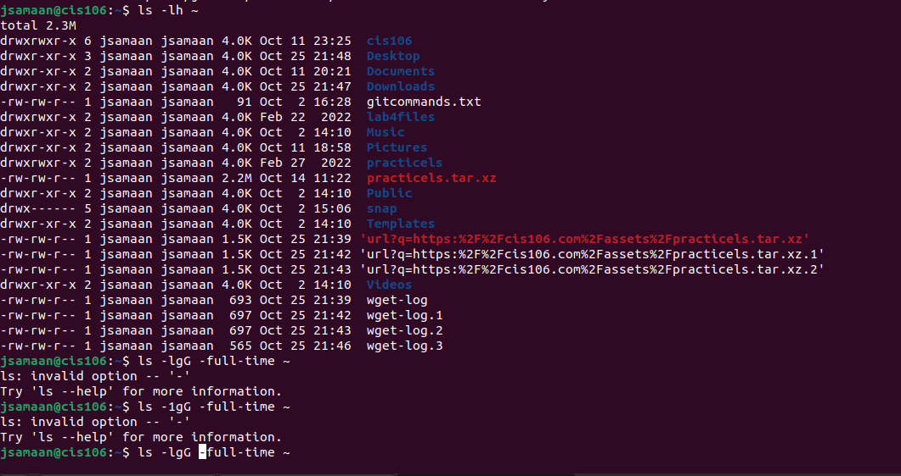
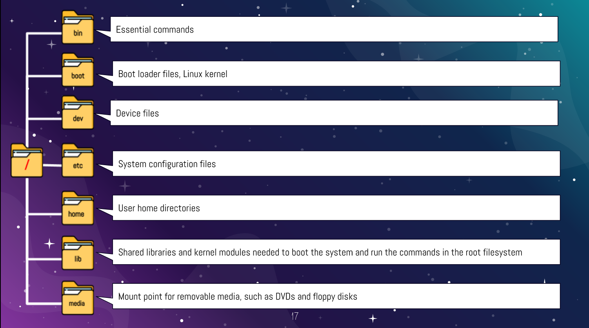
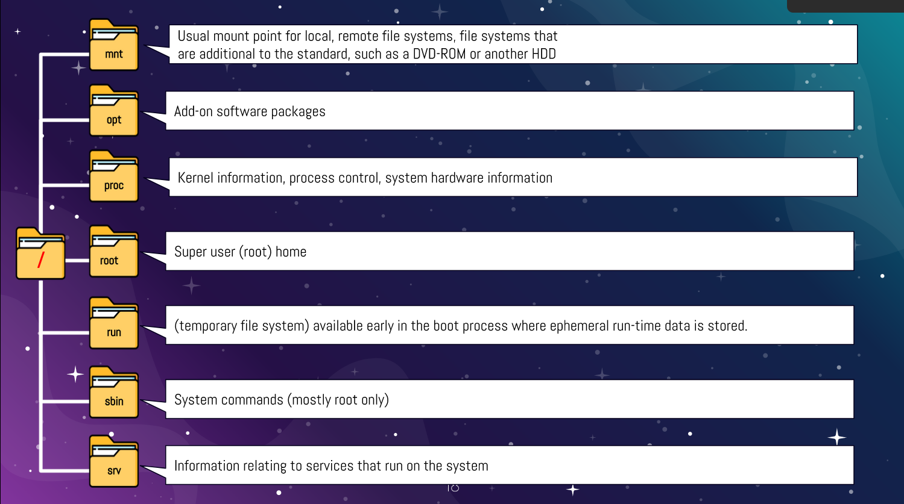
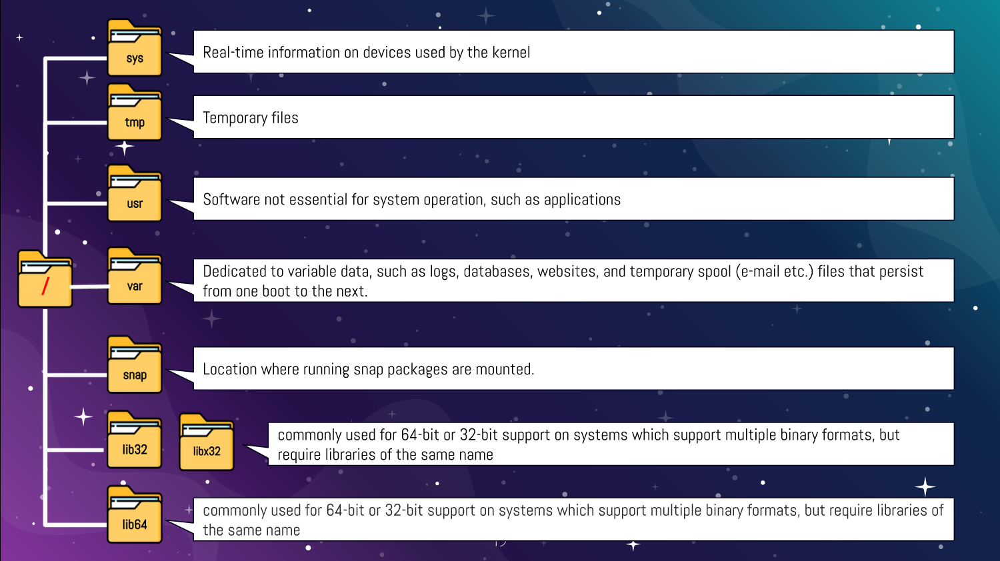

# Week Report 4

## Practice from the presentation the Linux filesystem:

### Practice 1

### Practice 2

### Practice 3

## The Linux filesystem directories and their purpose:

 
 

## All the commands for navigating the filesystem:

| Command | What it does             | Syntax | Example |
| ------- | ------------------------ | ------ | ------- |
| pwd     | prints current directory | pwd    | 'pwd'   |
| cd      | current directory        | cd     | 'cd'    |
| ls      | list files               | ls     | 'ls'    |

## Basic Terminology:
* **File system:** The way in which files are named and where they are put for storage and retrieval. 
* **Current directory:** Where all the commands are being executed.
* **parent directory:** A directory that contains more folders (subdirectories).
* **the difference between your home directory and the home directory:** The base of the file tree versus your home directory is within the home directory.
* **pathname:** The location of a file or other items in a hierarchy.
* **relative path:** Link that points to a file location on the page where the link is located.
* **absolute path:** Starts from the root and describes every step you must take through the file system.
