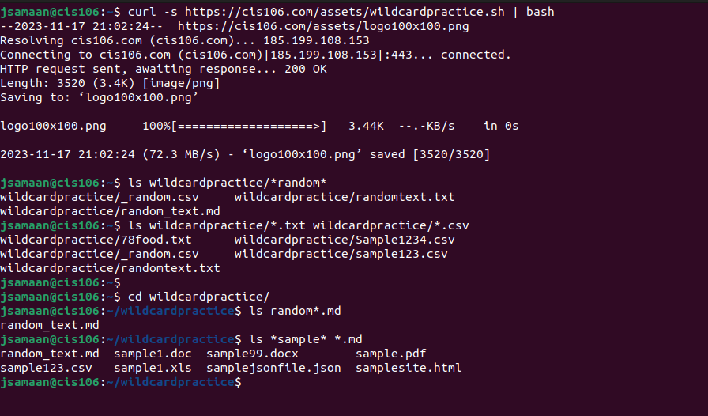
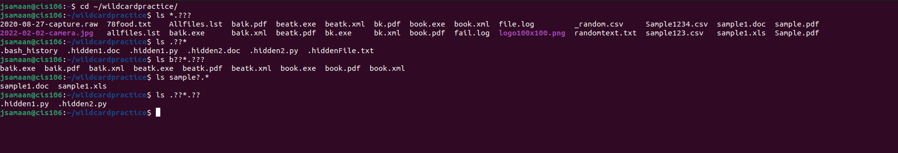
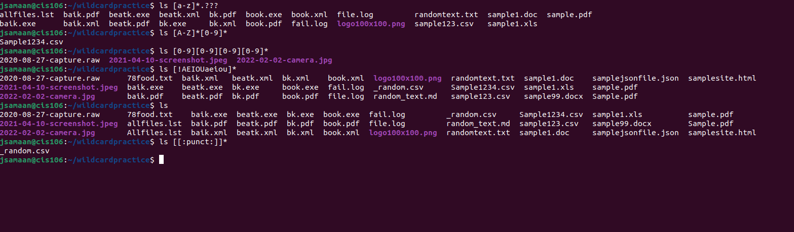

# Week Report 6

## Types of Wildcards

## Wildcard *
1. *: allows for 0 or multiple characters
   * ls *.txt
   * ls *.txt*
   * ls -A *demo*
## Wildcard ?
2. ?: allows for 1 character
   * ls program?.txt
   * rm assets/.??*.doc
   * ls -A .??*????
## Wildcard []
 []: allows for a set of characters
   * ls [A-Z].txt
   * ls [0-9].png
   * ls [a-z0-9].xls
## Practice Question Answers
5. 

6. 

7. 

## Brace Expansion
 * Allows you to generate arbitrary strings used with commands.
 * Ex. mkdir -p videos/{funny,sad}/{mp4files,avi}/new{1..9}
 * Ex. touch file {A-Z}.txt
 * Ex. rm -r {file1,file2,file3} 